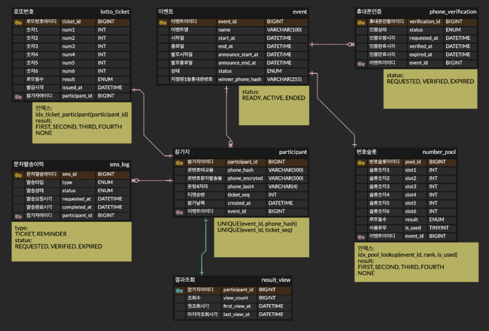

# Lotto Event System

휴대폰 인증 기반 로또 이벤트 시스템. 이벤트 생성 시 10,000개의 로또 번호 풀을 사전 생성하고, 참가자에게 확률적으로 배정한다.

## 기술 스택

### Backend
| 분류 | 기술 |
|------|------|
| Language | Java 17 |
| Framework | Spring Boot 4.0.2 |
| Build | Gradle |
| ORM | MyBatis 4.0.1 |
| DB | MySQL (운영) / H2 in-memory (로컬 개발) |
| Cache | Redis (인증번호 캐싱, 3분 TTL) |
| Security | AES-GCM 전화번호 암호화, SHA-256 해시 |

### Frontend
| 분류 | 기술 |
|------|------|
| 템플릿 | JSP  |
| 스크립트 | Vanilla JavaScript |
| 스타일 | Custom CSS |
| 통신 | Fetch API (REST JSON) |

> JSP 파일은 `src/main/webapp/WEB-INF/views/`에 위치하며 `PageController`가 각 URL을 뷰로 라우팅한다.
> JS/CSS 정적 파일은 `src/main/resources/static/`에서 그대로 서빙된다.

---

## 프로젝트 구조

```
src/
├── main/
│   ├── java/com/company/lotto/
│   │   ├── LottoApplication.java
│   │   ├── config/
│   │   │   ├── CodeStore.java              # 인증코드 저장소 인터페이스
│   │   │   ├── RedisCodeStore.java         # Redis 구현체
│   │   │   └── DemoDataInitializer.java    # H2 프로파일 시 데모 풀 자동 생성
│   │   ├── controller/
│   │   │   ├── LottoController.java        # REST API 엔드포인트
│   │   │   ├── PageController.java         # JSP 뷰 라우팅 (/, /events, /participate 등)
│   │   │   └── GlobalExceptionHandler.java # 전역 예외 처리
│   │   ├── service/
│   │   │   ├── LottoService.java           # 참가/결과 조회 비즈니스 로직
│   │   │   ├── NumberPoolService.java      # 번호 풀 생성 (10,000개)
│   │   │   └── VerificationService.java    # 인증/해시/암호화
│   │   ├── domain/                         # 엔티티
│   │   │   ├── Event.java
│   │   │   ├── Participant.java
│   │   │   ├── LottoTicket.java
│   │   │   ├── NumberPool.java
│   │   │   ├── PhoneVerification.java
│   │   │   └── ResultView.java
│   │   ├── dto/
│   │   │   ├── common/ApiResponse.java
│   │   │   ├── event/                      # 이벤트 관련 요청/응답
│   │   │   ├── lotto/                      # 참가/결과 요청/응답
│   │   │   └── verification/               # 인증 요청/응답
│   │   └── repository/                     # MyBatis Mapper 인터페이스
│   └── resources/
│       ├── application.yaml                # 공통 설정
│       ├── application-h2.yaml             # 로컬 개발 (H2)
│       ├── application-local.yaml          # 로컬 개발 (MySQL)
│       ├── schema.sql                      # MySQL DDL
│       ├── schema-h2.sql                   # H2 DDL
│       ├── data-h2.sql                     # H2 데모 데이터
│       ├── mapper/                         # MyBatis XML
│       └── static/                         # JS / CSS 정적 파일
│           ├── js/
│           │   ├── lotto.js               # 참가 페이지 로직
│           │   ├── events.js              # 이벤트 목록 로직
│           │   ├── result.js              # 결과 조회 로직
│           │   ├── admin.js               # 관리자 로직
│           │   └── index.js               # 메인 페이지 로직
│           └── css/
│               ├── lotto.css
│               ├── events.css
│               ├── result.css
│               ├── admin.css
│               └── index.css
└── webapp/
    └── WEB-INF/
        └── views/                          # JSP 뷰 템플릿
            ├── index.jsp                   # 메인 페이지  → /
            ├── events.jsp                  # 이벤트 목록  → /events
            ├── participate.jsp             # 이벤트 참가  → /participate
            ├── result.jsp                  # 당첨 결과    → /result
            └── admin.jsp                   # 관리자 페이지 → /admin
```

---


## 환경 변수

| 변수 | 설명 | 기본값 |
|------|------|--------|
| `LOTTO_DB_URL` | MySQL JDBC URL | (필수) |
| `LOTTO_DB_USERNAME` | DB 사용자명 | (필수) |
| `LOTTO_DB_PASSWORD` | DB 비밀번호 | (필수) |
| `REDIS_HOST` | Redis 호스트 | (필수) |
| `REDIS_PORT` | Redis 포트 | `6379` |
| `PHONE_HASH_PEPPER` | 전화번호 해시 Pepper | (필수, 운영 시 변경) |
| `PHONE_ENCRYPT_KEY` | 전화번호 암호화 키 | (필수, 운영 시 변경) |

---

## 핵심 비즈니스 로직

### 참가 흐름

```
이벤트 목록 → 참가 페이지 → 휴대폰 번호 입력 → 인증번호 발송(Redis 저장, 3분 TTL)
→ 인증번호 입력 → 참가 버튼 → 번호 풀에서 슬롯 배정 → 로또 티켓 발급
```

- 이미 참가한 번호로 인증 후 참가 시도 시, 에러 대신 **기존 발급 번호를 그대로 표시**한다.
- 발표 기간(announce_start_at ~ announce_end_at)에만 결과 조회가 가능하다.

### 당첨 확률 구조

이벤트당 10,000개 슬롯: 1등 1개, 2등 5개, 3등 44개, 4등 950개, 미당첨 9,000개.

ticketSeq(참가 순서)에 따라 자격 범위가 결정되고, 해당 범위 내 남은 슬롯에서 랜덤 배정된다.

| ticketSeq | 자격 등수 |
|-----------|----------|
| 1 ~ 999 | 4등, 미당첨 |
| 1,000 ~ 1,999 | 3등, 4등, 미당첨 |
| 2,000 ~ 7,000 | 2등, 3등, 4등, 미당첨 |
| 7,001 ~ 8,000 | 3등, 4등, 미당첨 |
| 8,001 ~ 10,000 | 4등, 미당첨 |

1등은 이벤트 생성 시 지정된 전화번호 해시와 일치하는 참가자에게만 배정된다.

---

## API

### 이벤트

| Method | Endpoint | 설명 |
|--------|----------|------|
| GET | `/api/events?page=1&size=10` | 이벤트 목록 (페이지네이션) |
| POST | `/api/events` | 이벤트 생성 + 번호 풀 자동 생성 |
| GET | `/api/events/{eventId}` | 이벤트 상세 |
| GET | `/api/events/active` | 현재 진행 중인 이벤트 |
| GET | `/api/events/announcing` | 현재 발표 중인 이벤트 |
| POST | `/api/events/{eventId}/generate-pool` | 번호 풀 재생성 |

### 인증

| Method | Endpoint | 설명 |
|--------|----------|------|
| POST | `/api/verification/send` | 인증번호 발송 |
| POST | `/api/verification/verify` | 인증번호 확인 |

### 참가 / 결과

| Method | Endpoint | 설명 |
|--------|----------|------|
| POST | `/api/lotto/participate` | 로또 참가 (중복 시 기존 번호 반환) |
| POST | `/api/lotto/result` | 결과 조회 (발표 기간만) |

---

## 데이터 모델

```
event
 ├── number_pool        # 사전 생성된 로또 번호 풀 (소모성)
 ├── participant        # 참가자 (휴대폰 해시/암호화)
 │    ├── lotto_ticket  # 발급된 티켓 (번호 + 결과)
 │    ├── result_view   # 결과 조회 이력
 │    └── sms_log       # SMS 발송 이력
 └── phone_verification # 휴대폰 인증 요청
```

### ERD


전체 DDL은 [`src/main/resources/schema.sql`](src/main/resources/schema.sql) 참고.

---

## 동시성 처리

동시 참가 요청에 대해 3단계 방어를 적용한다.

| 방어 계층 | 대상 | 방법 |
|-----------|------|------|
| ticket_seq 중복 | `selectNextTicketSeq` | `SELECT MAX + 1 ... FOR UPDATE` |
| 중복 참가 | `participant` INSERT | `UNIQUE INDEX (event_id, phone_hash)` + `DuplicateKeyException` 처리 |
| 슬롯 중복 배정 | `findRandomAvailableSlot` | `SELECT ... FOR UPDATE` |

---

## 개인정보 보호

전화번호 원본은 저장하지 않는다.

| 저장 형태 | 용도 | 방식 |
|-----------|------|------|
| `phone_hash` | 중복 체크, 결과 조회 | SHA-256 (Salt + Pepper) |
| `phone_encrypted` | 복호화 필요 시 | AES-GCM (랜덤 IV) |
| `phone_last4` | 화면 표시용 | 뒷 4자리 평문 |
